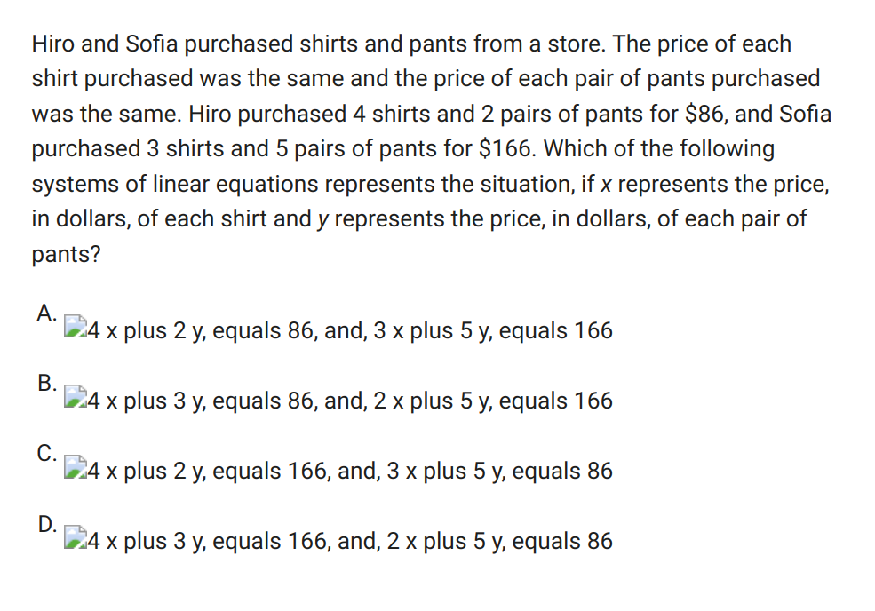

# Building a better question bank

## The College Board doesn't care about you.

Did you know the College Board has a [super secret question bank](https://satsuitequestionbank.collegeboard.org/digital/search)?
It literally has thousands of SAT questions that you can sort and filter by [domain](https://satsuitequestionbank.collegeboard.org/digital/search) and [skill](https://satsuitequestionbank.collegeboard.org/digital/search) and [difficulty](https://satsuitequestionbank.collegeboard.org/digital/search).
At first glance, this seems like a fantastic resource.
But look little closer and you start to realize why they might a little shy about promoting it.



For a ton of the math questions, the equations are inserted as images, but the images don't render properly, so the browswer renders the alt text for screen readers instead.

The preview that pops up shows you the answer before you have a chance to read the question, 
so if you want to use these to study, you have to download the questions as a pdf.
Which isn't so bad, unless you want to download all the questions.
If you want all the questions, you have to click every check box individually because the ui/ux designers didn't even bother putting in a "select all / deselect all" button.

Even once you've selected a set, how do you keep track of what you've already covered.
Clearly the questions have id fields, but you can't search for question by id, or,
even better, filter out questions by id so you only have fresh ones in the list,
so ultimately it's a really hard resource to use effectively.

## Why not use Khan Academy?
Similar problems to the above.
But in the case of Khan Academy, there is a ton of noise around everything, 
and you can't redo specific questions from their quizzes. 
Want to retry that tough math question on triangles? Good luck finding it.
You just have to click "try again" and hope the roulette wheel lands you on the right question.

## Fuck it, let's build it better.
Because I have no friends, I decided to build a better question bank.
I started by selecting all the questions to extract them into pdfs.
Then I passed them through sejda pdf to get two fat .txt files, one for the Reading and Writing questions, and one fo rthe math questions. 

Here's what just one of the 3000 questions looked like in plain text:


```text
Question ID 533d6d0e
Assessment Test Domain Skill Difficulty
SAT Reading and Writing Information and Central Ideas and Easy
Ideas Details
ID: 533d6d0e
To make her art more widely available, graphic artist Elizabeth Catlett turned to linocuts. In linocut
printing, an artist carves an image into a sheet of linoleum to create a stamp that is used to mass-
produce prints. In the linocut series The Black Woman (1946–1947), Catlett depicts the everyday
experiences of Black women alongside the achievements of well-known Black women. This pairing
invites the viewer to draw connections among the women. The linocut process enabled Catlett’s work to
reach a wide audience and supported her aim to unite Black women through her art.
According to the text, what is significant about Catlett’s use of linocut printing?
A. Linocut printing involved using materials that were readily available to Catlett. 
B. Linocut printing helped Catlett use art to connect people, especially Black women.
C. Catlett became commercially successful once she started using linocut printing. 
D. Catlett was one of the first Black artists to use linocut printing.
ID: 533d6d0e Answer
Correct Answer: B
Rationale
Choice B is the best answer. The last sentence states that the linocut process “supported her [Catlett’s] aim to unite
Black women through her art.”
Choice A is incorrect. The text briefly describes the linocut printing process but doesn’t discuss the availability of the
materials used in the process. Choice C is incorrect. The text says that the linocut process “enabled Catlett’s work to
reach a wide audience,” but that doesn’t mean that linocuts made her “commercially successful.” In other words, we don’t
know how much money she made off her linocuts—we only know that more people were able to see her work. Choice D
is incorrect. The text says that Catlett depicted Black women in her linocuts, but not that she was one of the first Black
artists to use linocut printing.
Question Difficulty: Easy

```

This was already an improvement on the original pdf, but I felt I could do better.
So I set out to parsing this document programmatically.


The most reasonable choice for such a task was of course python, an easy to use, high level programming language with rich ecosystem of libraries designed for parsing unstructured data into structured formats, like `json`.

But I am not a reasonable man, so I chose rust instead, a low level language designed for performance critical applications, such as those found in embedded systems for military equipment and high volume, distributed systems like you might find for financial transactions.

I then proceeded to write the worlds shittiest program in rust, which seven thousand years to compile and another several thousand to run.

```rust

// Example of my shitty programming skills
QuestionPart::Metadata => {
    if line.contains("SAT") {
        if line.contains("Information and") {
            domain = Domain::InformationAndIdeas;
        }
        if line.contains("Craft and Structure") {
            domain = Domain::CraftAndStructure;
        }
        if line.contains("Standard English") {
            domain = Domain::StandardEnglishConventions;
        }
        if line.contains("Expression of Ideas") {
            domain = Domain::ExpressionOfIdeas;
        }

        // skills
        if line.contains("Words in Context") {
            skill = Skill::WordsInContext;
        }
        if line.contains("Textual Evidence") {
            skill = Skill::TextualEvidenceAndPurpose;
        }
        if line.contains("Cross-Text Connections") {
            skill = Skill::CrossTextConnections;
        }
        if line.contains("Command of Evidence") {
            skill = Skill::CommandOfEvidence;
        }
        if line.contains("Inferences") {
            skill = Skill::Inferences;
        }
        if line.contains("Central Ideas and") {
            skill = Skill::CentralIdeasAndDetails;
        }
        if line.contains("Rhetorical Synthesis") {
            skill = Skill::RhetoricSythesis;
        }
        if line.contains("Transitions") {
            skill = Skill::Transitions;
        }
        if line.contains("Boundaries") {
            skill = Skill::Boundaries;
        }
        if line.contains("Form, Structure, ") {
            skill = Skill::FormStructureAndSense;
        }
    } else if line.contains("ID:") {
        portion = QuestionPart::Prompt;
    }

    continue;
}

```

But it worked. Lo!


```json
{
    "id": "533d6d0e",
    "domain": "InformationAndIdeas",
    "skill": "CentralIdeasAndDetails",
    "difficulty": "Easy",
    "prompt": "To make her art more widely available, graphic artist Elizabeth Catlett turned to linocuts. In linocutprinting, an artist carves an image into a sheet of linoleum to create a stamp that is used to mass-produce prints. In the linocut series The Black Woman (1946–1947), Catlett depicts the everydayexperiences of Black women alongside the achievements of well-known Black women. This pairinginvites the viewer to draw connections among the women. The linocut process enabled Catlett’s work toreach a wide audience and supported her aim to unite Black women through her art.",
    "answer_choices": [
      "A. Linocut printing involved using materials that were readily available to Catlett. ",
      "B. Linocut printing helped Catlett use art to connect people, especially Black women.",
      "C. Catlett became commercially successful once she started using linocut printing. ",
      "D. Catlett was one of the first Black artists to use linocut printing."
    ],
    "correct_answer": "B",
    "correct_answer_rationale": "Choice B is the best answer. The last sentence states that the linocut process “supported her [Catlett’s] aim to unite Black women through her art.” ",
    "incorrect_answer_rationales": "Choice A is incorrect. The text briefly describes the linocut printing process but doesn’t discuss the availability of the materials used in the process. Choice C is incorrect. The text says that the linocut process “enabled Catlett’s work to reach a wide audience,” but that doesn’t mean that linocuts made her “commercially successful.” In other words, we don’t know how much money she made off her linocuts—we only know that more people were able to see her work. Choice D is incorrect. The text says that Catlett depicted Black women in her linocuts, but not that she was one of the first Black artists to use linocut printing. "
  }

```


Luckily this gave an opportunity to practice my typing skills.


## The College Board doesn't care about you.


